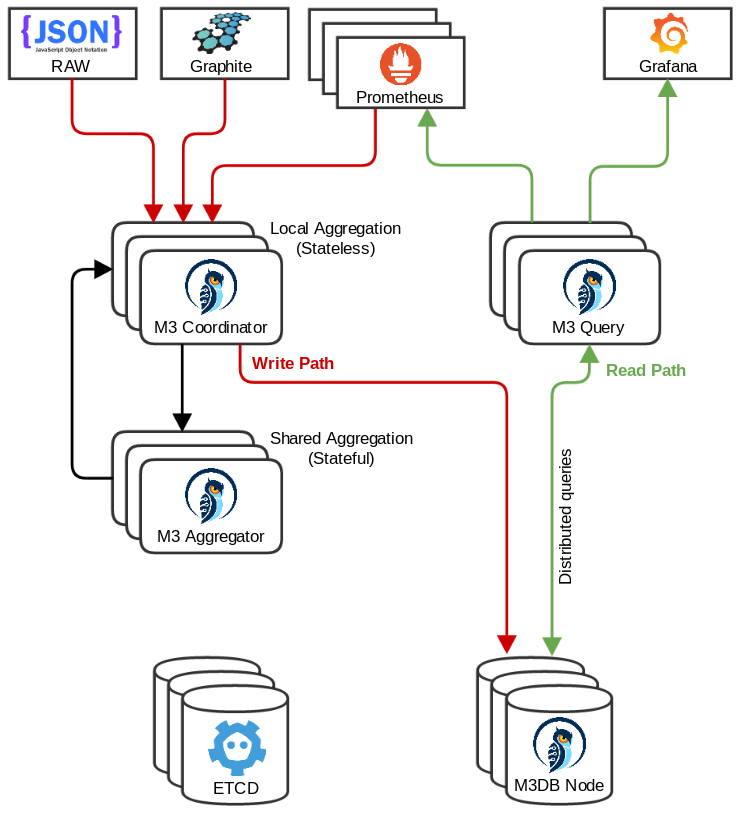

M3 Complete Deployment Lab Environment
================
---

* ETCD nodes: etcd01/02/03
* M3 DB Nodes: m3db01/02/03
* M3 Coordinator Nodes: m3cr01/02/03
* M3 Aggregator Nodes: m3ag01/02/03/04/05/06
* Metric Sources: cadvisor + node-exporter + M3 Components
* Prometheus
* Grafana

  

## Credits
The below examples have served as inspiration, thanks for sharing

* [M3 Source](https://github.com/m3db/m3/tree/master/scripts)
* [mmedvede](https://github.com/mmedvede/m3-sandbox)
* [stevehorsfield](https://github.com/stevehorsfield/m3-example-terraform)
